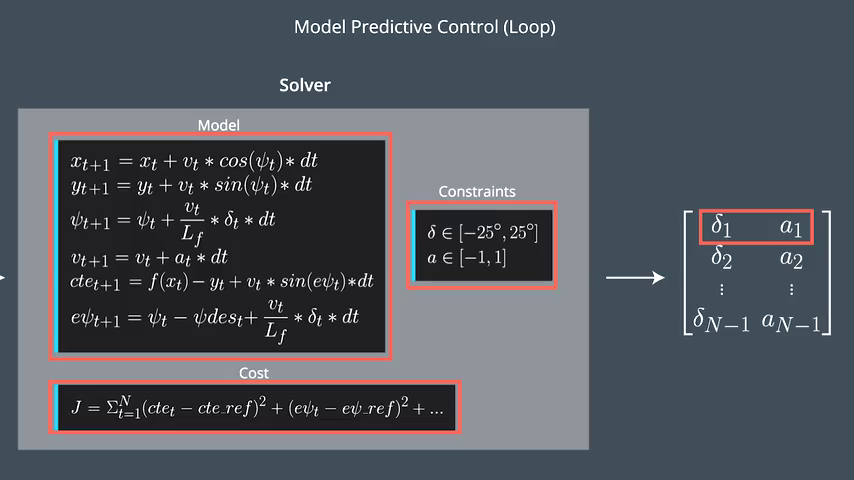

# CarND-Controls-MPC
Self-Driving Car Engineer Nanodegree Program

# 1.Model
The kinematic model used in the project is described in the following formulas:

## 1.1 State
The state variables of the model are comprised of:

* *x,y* - current coordinates of the vehicle
* *psi* - current vehicle direction
* *v* - current speed (magnitue)
* *cte* - cross track error
* *epsi* - the error between the desired direction and current direction


## 1.2 State update
The model calculates the future state by applying the formulas above to the current state. Inputs to the state are the steering (*delta*) and throttle (*a*) values.

# 2. Timestep and elapsed duration
A final value of N = 10 and dt = 0.1 were chosen.

These two values determine the future prediction and length of optimizition of the MPC controller. The duration of the prediction is T=N*dt, in our case, 1 second. 

Given that our reference track is an estimation with a 3rd degree polynomial, it will be approximate only in areas close to the vehicle. It doesn't make much sense to chose N/dt values that extend far into the future, so choosing a duration of 1 second, seems like a reasonable choice. 

Other values were chosen, specially for dt, but they just seem to increase computational cost, given the MPC controller needs to do a lot more estimations, and didn't yield better track performance. Actually, some values of dt would yield unstable MPC behavior.

# 3. Polynomial fit
The waypoints passed are mapped into car coordinates from map coordinates first, and then fitted to a polynomial of third order. This happens in main.cpp:100-109.
The mapping has the advantage to simplify calculations, given that some of the values turn into 0, in particular *px*, *py* and *psi*

```c++
  //----------------------------------------------------------------------------
  // map to car coordinate transform. It implies ->  px = 0, py = 0, and psi = 0
  Eigen::VectorXd ptscar_x(ptsx.size());
  Eigen::VectorXd ptscar_y(ptsy.size());
  for (int i = 0; i < ptsx.size(); i++) {
    double dx = ptsx[i] - px;
    double dy = ptsy[i] - py;
    ptscar_x[i] = dx * cos(-psi) - dy * sin(-psi);
    ptscar_y[i] = dx * sin(-psi) + dy * cos(-psi);
  }

  auto coeffs = polyfit( ptscar_x, ptscar_y, 3);
```

# 4. MPC 
MPC controller is implemented in the MPC.cpp class by using IPOPT and CppAD. 
## 4.1 Cost function
A cost function is defined in FG_eval::operator(). The cost function adds up the cost into the fg[0] bin. 
```c++
    for (int t = 0; t < N; t++) {
      fg[0] += 4000*CppAD::pow(vars[cte_start + t], 2);
      fg[0] += 4000*CppAD::pow(vars[epsi_start + t], 2);
      fg[0] += CppAD::pow(vars[v_start + t] - ref_v, 2);
    }

    // Minimize the use of actuators.
    for (int t = 0; t < N - 1; t++) {
      fg[0] += 5*CppAD::pow(vars[delta_start + t], 2);
      fg[0] += 5*CppAD::pow(vars[a_start + t], 2);
    }

    // Minimize the value gap between sequential actuations.
    for (int t = 0; t < N - 2; t++) {
      fg[0] += 200*CppAD::pow(vars[delta_start + t + 1] - vars[delta_start + t], 2);
      fg[0] += 10*CppAD::pow(vars[a_start + t + 1] - vars[a_start + t], 2);
    }
```
Through experimentation I chose values for the cost function.

I am heavily adding cost to CTE and epsi deviations. This makes the MPC controller try to follow the desired track quite strictly and actuate the throttle agressively for such effect, which is an interesting effect.
Other factors added to the cost are the not to use actuators agressively, and minimize its change through time.

Note 'ref_v', as the reference velocity. I set it to 100, so controller will try to go that fast, but will often prioritize keep vehicle close to desired track (by braking) over speeding. Lowering the weight on the CTE cost makes this effect very obvious.

## 4.2 Model and Solver
The model is implemented in FG_eval::operator():109-127 through the use of 'constrains' to zero. This makes IPOPT to match those values of the model, and also makes it calculate the delta and throttle values which are our values of interest.
The solver glue is implemted under MPC::Solve

# 5. Latency
In order to deal with actuator latency the following technique is used:
* A state simulation is run during the duration of the latency
* The resulting state of the simulation is then fed into the MPC solver.

Because due to latency, our throttle and steer inputs are indeed only affecting behavior of the vehicle 'latency seconds' into the future, the only thing we need is the starting state of the vehicle at that moment. Given we have a kinematic model we can estimate the state of the vehicle after the latency time has elapsed. I used the following function in MPC::stateSimulation:133-165 to work it out:

```c++
Eigen::VectorXd MPC::stateSimulation(Eigen::VectorXd initState, Eigen::VectorXd coeffs, double timeInS, double steer, double throttle ) {
    Eigen::VectorXd st(6);

    int count = timeInS/dt;

    st = initState;

    double x0,y0,psi0,v0,cte0,epsi0;

    for(int i=0; i<count; i++) {
        x0 = st[0];
        y0 = st[1];
        psi0 = st[2];
        v0   = st[3];
        cte0 = st[4];
        epsi0 = st[5];

        st[0] = x0 + v0 * cos(psi0) * dt;
        st[1] = y0 + v0 * sin(psi0) * dt;
        st[2] = psi0 - v0 * steer/Lf * dt;
        st[3] = v0 + throttle * dt;


        // during latency calculations, cte & epsi don't affect the future state
        double f0 = coeffs[0] + coeffs[1] * x0 + coeffs[2] * pow(x0,2) + coeffs[3] * pow(x0,3);
        double psides0 = atan(coeffs[1] + 2*coeffs[2]*x0 + 3*coeffs[3]*pow(x0, 2)); 

        st[4] = (f0-y0) + (v0 * sin(epsi0) * dt);
        st[5] = (psi0 - psides0) - v0 * steer/Lf *dt;
    }

    return st;
}

```
This method is called before calling the solver in main.cpp:139, and the output state is what is then fed onto MPC:Solve. 
```c++
  if(delayInS!=0) {
      // get future state if we are simulating latency
      // we consider throttle_value an approximation of acceleration
      state = mpc.stateSimulation(state, coeffs, delayInS, steer_value * deg2rad(25)*Lf, throttle_value );

  }

  auto vars = mpc.Solve(state, coeffs);
```

While this is a generic solution for any given delay duration, in our particular chosen values of N=10 and dt=0.1, makes it that the simulation loop only interates once, and therefore calculates just the next step. Therefore for these particular values it could be simplied further.

# 6. Final Considerations
[Here is a video](mpc.mp4) of the car with ref_v=100 and all the above values set. Due to the latency adjustment mechanism used, the predicted green track, coming out of the MPC controller is offset 'latency ms' into the future. This is sensical, given the actuation of the controller is only taking place exactly at those moments.


---
# ORIGINAL README

## Dependencies

* cmake >= 3.5
 * All OSes: [click here for installation instructions](https://cmake.org/install/)
* make >= 4.1
  * Linux: make is installed by default on most Linux distros
  * Mac: [install Xcode command line tools to get make](https://developer.apple.com/xcode/features/)
  * Windows: [Click here for installation instructions](http://gnuwin32.sourceforge.net/packages/make.htm)
* gcc/g++ >= 5.4
  * Linux: gcc / g++ is installed by default on most Linux distros
  * Mac: same deal as make - [install Xcode command line tools]((https://developer.apple.com/xcode/features/)
  * Windows: recommend using [MinGW](http://www.mingw.org/)
* [uWebSockets](https://github.com/uWebSockets/uWebSockets)
  * Run either `install-mac.sh` or `install-ubuntu.sh`.
  * If you install from source, checkout to commit `e94b6e1`, i.e.
    ```
    git clone https://github.com/uWebSockets/uWebSockets 
    cd uWebSockets
    git checkout e94b6e1
    ```
    Some function signatures have changed in v0.14.x. See [this PR](https://github.com/udacity/CarND-MPC-Project/pull/3) for more details.
* Fortran Compiler
  * Mac: `brew install gcc` (might not be required)
  * Linux: `sudo apt-get install gfortran`. Additionall you have also have to install gcc and g++, `sudo apt-get install gcc g++`. Look in [this Dockerfile](https://github.com/udacity/CarND-MPC-Quizzes/blob/master/Dockerfile) for more info.
* [Ipopt](https://projects.coin-or.org/Ipopt)
  * Mac: `brew install ipopt`
       +  Some Mac users have experienced the following error:
       ```
       Listening to port 4567
       Connected!!!
       mpc(4561,0x7ffff1eed3c0) malloc: *** error for object 0x7f911e007600: incorrect checksum for freed object
       - object was probably modified after being freed.
       *** set a breakpoint in malloc_error_break to debug
       ```
       This error has been resolved by updrading ipopt with
       ```brew upgrade ipopt --with-openblas```
       per this [forum post](https://discussions.udacity.com/t/incorrect-checksum-for-freed-object/313433/19).
  * Linux
    * You will need a version of Ipopt 3.12.1 or higher. The version available through `apt-get` is 3.11.x. If you can get that version to work great but if not there's a script `install_ipopt.sh` that will install Ipopt. You just need to download the source from the Ipopt [releases page](https://www.coin-or.org/download/source/Ipopt/) or the [Github releases](https://github.com/coin-or/Ipopt/releases) page.
    * Then call `install_ipopt.sh` with the source directory as the first argument, ex: `sudo bash install_ipopt.sh Ipopt-3.12.1`. 
  * Windows: TODO. If you can use the Linux subsystem and follow the Linux instructions.
* [CppAD](https://www.coin-or.org/CppAD/)
  * Mac: `brew install cppad`
  * Linux `sudo apt-get install cppad` or equivalent.
  * Windows: TODO. If you can use the Linux subsystem and follow the Linux instructions.
* [Eigen](http://eigen.tuxfamily.org/index.php?title=Main_Page). This is already part of the repo so you shouldn't have to worry about it.
* Simulator. You can download these from the [releases tab](https://github.com/udacity/self-driving-car-sim/releases).
* Not a dependency but read the [DATA.md](./DATA.md) for a description of the data sent back from the simulator.


## Basic Build Instructions


1. Clone this repo.
2. Make a build directory: `mkdir build && cd build`
3. Compile: `cmake .. && make`
4. Run it: `./mpc`.

## Tips

1. It's recommended to test the MPC on basic examples to see if your implementation behaves as desired. One possible example
is the vehicle starting offset of a straight line (reference). If the MPC implementation is correct, after some number of timesteps
(not too many) it should find and track the reference line.
2. The `lake_track_waypoints.csv` file has the waypoints of the lake track. You could use this to fit polynomials and points and see of how well your model tracks curve. NOTE: This file might be not completely in sync with the simulator so your solution should NOT depend on it.
3. For visualization this C++ [matplotlib wrapper](https://github.com/lava/matplotlib-cpp) could be helpful.

## Editor Settings

We've purposefully kept editor configuration files out of this repo in order to
keep it as simple and environment agnostic as possible. However, we recommend
using the following settings:

* indent using spaces
* set tab width to 2 spaces (keeps the matrices in source code aligned)

## Code Style

Please (do your best to) stick to [Google's C++ style guide](https://google.github.io/styleguide/cppguide.html).

## Project Instructions and Rubric

Note: regardless of the changes you make, your project must be buildable using
cmake and make!

More information is only accessible by people who are already enrolled in Term 2
of CarND. If you are enrolled, see [the project page](https://classroom.udacity.com/nanodegrees/nd013/parts/40f38239-66b6-46ec-ae68-03afd8a601c8/modules/f1820894-8322-4bb3-81aa-b26b3c6dcbaf/lessons/b1ff3be0-c904-438e-aad3-2b5379f0e0c3/concepts/1a2255a0-e23c-44cf-8d41-39b8a3c8264a)
for instructions and the project rubric.

## Hints!

* You don't have to follow this directory structure, but if you do, your work
  will span all of the .cpp files here. Keep an eye out for TODOs.

## Call for IDE Profiles Pull Requests

Help your fellow students!

We decided to create Makefiles with cmake to keep this project as platform
agnostic as possible. Similarly, we omitted IDE profiles in order to we ensure
that students don't feel pressured to use one IDE or another.

However! I'd love to help people get up and running with their IDEs of choice.
If you've created a profile for an IDE that you think other students would
appreciate, we'd love to have you add the requisite profile files and
instructions to ide_profiles/. For example if you wanted to add a VS Code
profile, you'd add:

* /ide_profiles/vscode/.vscode
* /ide_profiles/vscode/README.md

The README should explain what the profile does, how to take advantage of it,
and how to install it.

Frankly, I've never been involved in a project with multiple IDE profiles
before. I believe the best way to handle this would be to keep them out of the
repo root to avoid clutter. My expectation is that most profiles will include
instructions to copy files to a new location to get picked up by the IDE, but
that's just a guess.

One last note here: regardless of the IDE used, every submitted project must
still be compilable with cmake and make./
